# Web 自动化测试管理系统

本项目是基于 **Spring Boot + Vue 3 + Selenium** 的前后端分离 Web 自动化测试平台，面向回归测试场景，支持可视化用例配置、自动化执行、权限控制、任务调度与测试报告统计。

## 项目亮点

- 无代码化配置测试用例（操作步骤 + 断言规则）
- Selenium 自动化执行，支持批量执行与失败重试
- 完整权限链路（登录鉴权 + 角色控制）
- 任务调度与测试报告联动，支持结果溯源
- 浏览器驱动复用，提升批量执行效率

## 技术栈

### 后端（`auto-test-backend`）

- 核心框架：Spring Boot `4.0.0`、Spring Security、MyBatis-Plus
- 安全机制：JWT、BCrypt
- 测试相关：JUnit 5、Selenium 4.x、rest-assured
- 数据处理：EasyExcel、HikariCP
- 工具依赖：Hutool、Jsoup、Lombok
- 数据库：MySQL `8.0+`
- 构建工具：Maven

### 前端（`web-auto-test-frontend`）

- 核心框架：Vue 3、Element Plus
- 网络请求：Axios（含拦截器封装）
- 样式方案：Less
- 可视化：ECharts（报告可视化预留）
- 工程化：npm、`vue.config.js`

## 功能模块预览

> 你完全可以在 README 里插图，GitHub 原生支持 Markdown 图片显示。
> 下面已按你提供的截图路径插入。

### 1) 首页

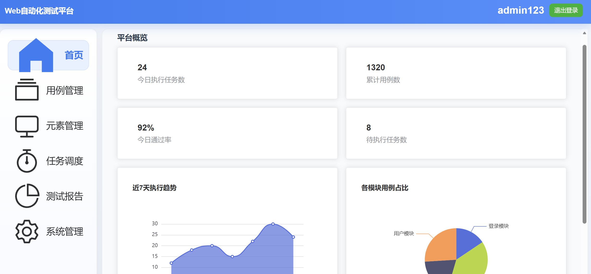

### 2) 用例管理

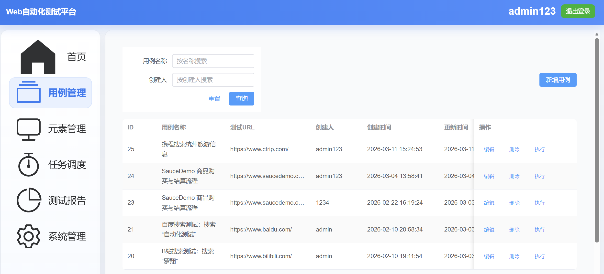

### 3) 新增/编辑用例

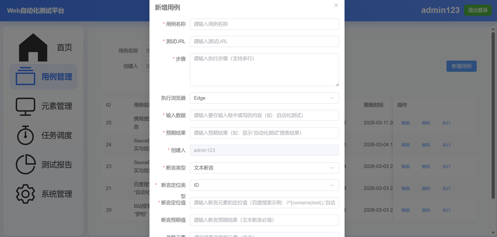

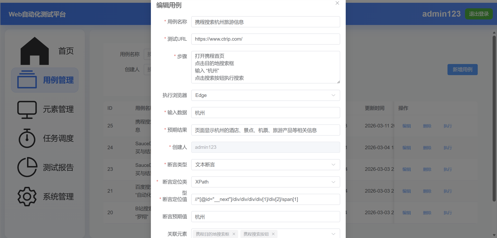

### 4) 元素管理与解析

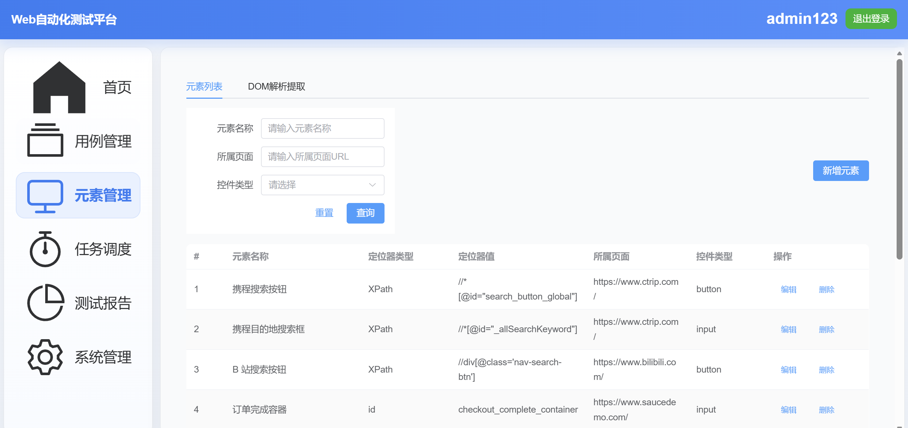

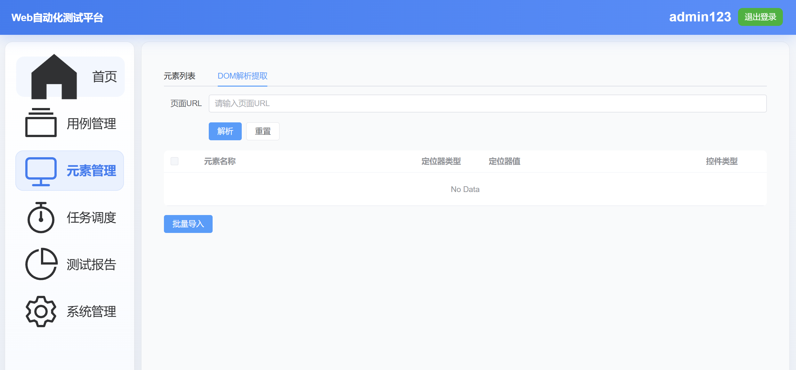

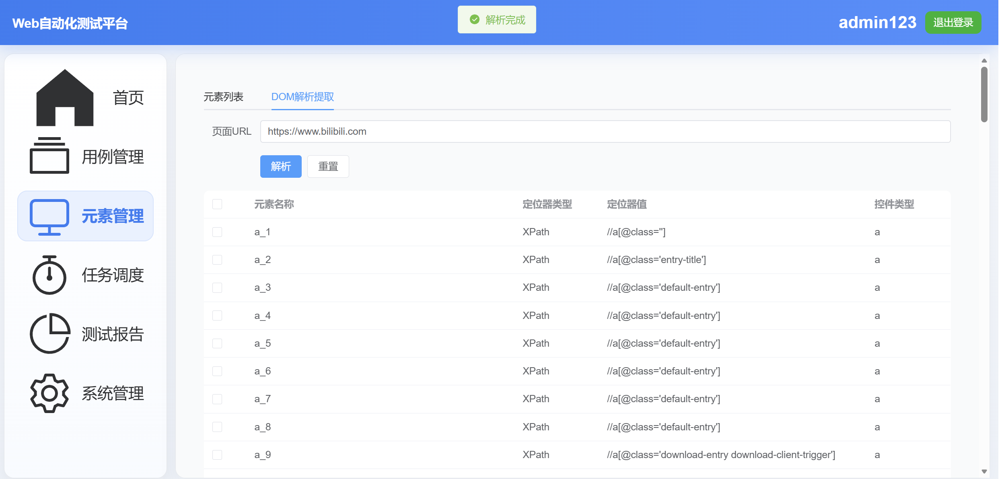

### 5) 任务调度

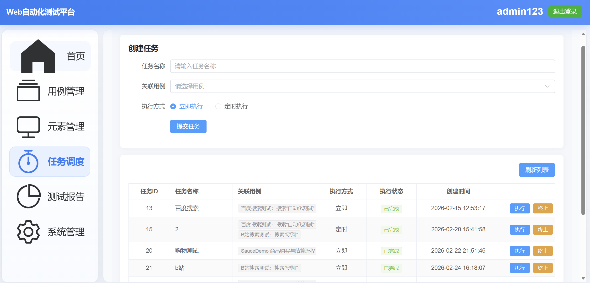

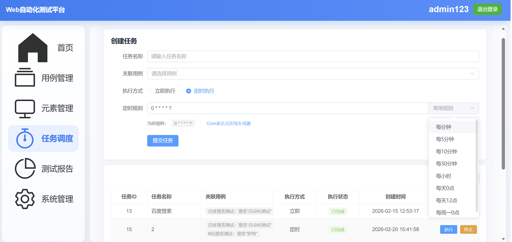

### 6) 测试报告

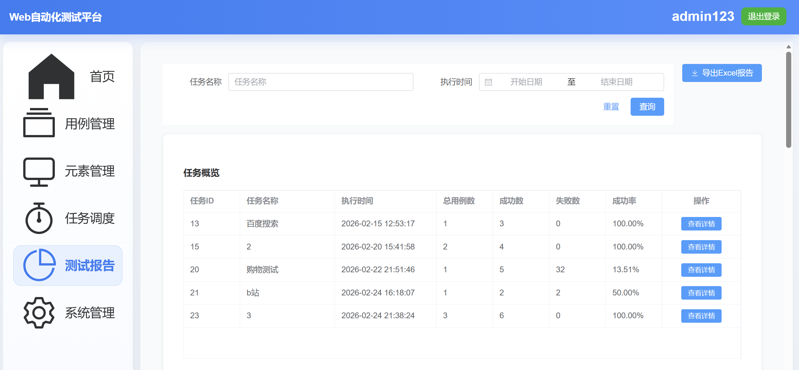

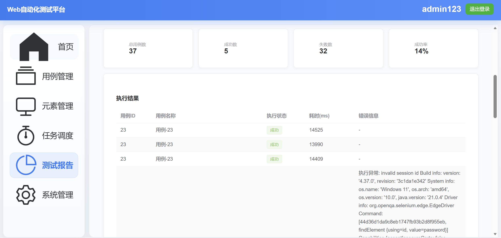

### 7) 系统管理

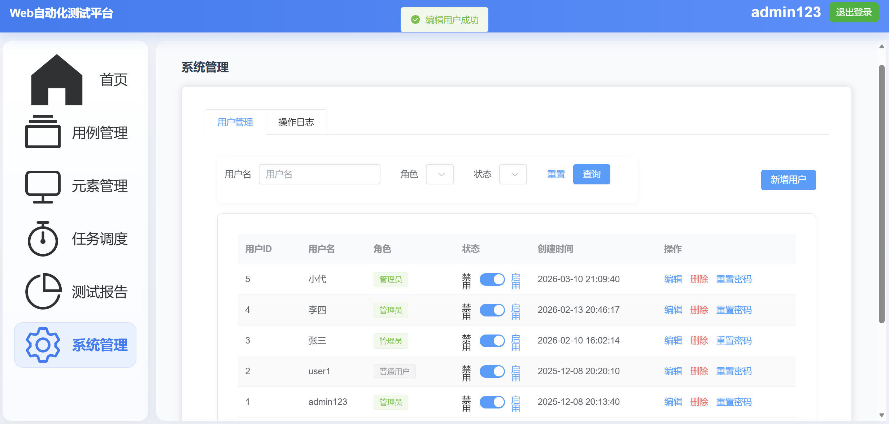

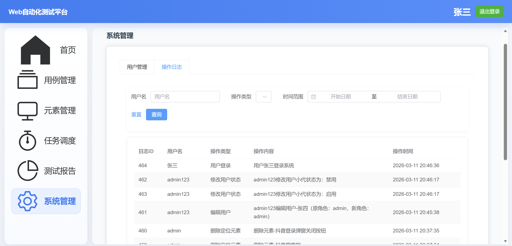

## 快速启动

### 前置环境

- JDK `21+`
- MySQL `8.0+`
- Node.js `14+`
- Maven `3.6+`

### 1. 克隆仓库

```bash
git clone https://github.com/2258954940/test-management-system.git
cd test-management-system
```

### 2. 启动后端（`auto-test-backend`）

```bash
cd auto-test-backend
```

配置数据库：

1. 本地创建数据库 `auto_test`（UTF-8）
2. 修改 `src/main/resources/application.yaml` 中数据源配置

```yaml
spring:
  datasource:
    url: jdbc:mysql://localhost:3306/auto_test?useSSL=false&serverTimezone=Asia/Shanghai
    username: root
    password: 123456
```

若你本地尚未新增 `task_id` 字段，可执行：

```sql
ALTER TABLE auto_test.test_result
ADD COLUMN task_id BIGINT COMMENT '关联任务 ID，绑定执行结果到具体任务';
```

启动后端：

```bash
mvn spring-boot:run
```

- 默认端口：`8000`
- 登录接口：`http://localhost:8000/api/user/login`

### 3. 启动前端（`web-auto-test-frontend`）

```bash
cd ../web-auto-test-frontend
npm install
npm run serve
```

- 默认端口：`8080`
- 访问地址：`http://localhost:8080`
- 默认账号：`admin / 123456`

## 核心功能说明

### 用户与权限

- 账号密码登录、JWT 鉴权
- 基于角色的接口访问控制（系统管理接口仅 `admin`）

### 用例管理

- 可视化编辑测试 URL、操作步骤、预期结果
- 支持动态断言（如 `TEXT`）
- 支持增删改查与 Excel 导出

### 自动化执行

- 一键触发 Selenium 脚本执行
- 显式等待 + JS 操作增强
- 支持批量执行、失败重试、截图留痕

### 任务调度

- 支持任务创建、立即执行
- 预留 Cron 定时能力
- 支持任务状态跟踪与日志查看

### 测试报告

- 自动统计执行成功/失败数据
- 成功率按“实际执行数”计算
- 任务-用例-执行结果全链路关联

## 已解决问题（实践记录）

- Spring Security 6.x 路由匹配适配
- 前后端跨域与登录 403 问题修复
- 任务/报告模块 SQL 与类型匹配问题修复
- 批量执行性能优化（浏览器驱动复用）

## 备注

- 本项目为毕业设计，仅用于学习交流
- 如有问题欢迎提交 Issue
- 联系邮箱：`2258954940@qq.com`